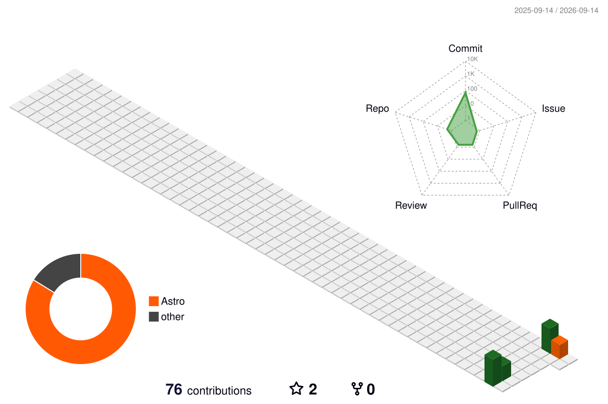

<picture>
  <source media="(prefers-color-scheme: dark)" srcset="https://capsule-render.vercel.app/api?type=waving&color=0:1C2730,100:A4763B&height=170&section=header&text=Abhishek%20Verma&fontColor=F2E9DC&fontSize=42&fontAlign=50&fontAlignY=34&desc=Software%20Engineer%20at%20Hakimo%20%C2%B7%20Bangalore&descSize=15&descAlign=50&descAlignY=54">
  
</picture>

<picture>
  <source media="(prefers-color-scheme: dark)" srcset="https://readme-typing-svg.demolab.com?font=IBM+Plex+Mono&weight=500&size=19&duration=3000&pause=800&color=D8AE72&center=true&vCenter=true&width=560&lines=TypeScript+and+React+at+the+front;Python+and+Flask+behind+it;Most+of+my+time+goes+to+what+runs+unattended">
  
</picture>

## 👨‍💻 About

- 🏢 Software engineer at **[Hakimo](https://www.hakimo.ai)**, building and running production systems for an AI security platform
- ⚙️ Across the stack — data model to API to the interface people use daily
- 🌙 Most of my time goes to the parts that run **unattended**, where a failure surfaces hours after the thing that caused it
- 🧪 I care more about how a change is **verified** than how it is written
- 🌐 [my-portfolio.iamabhishekverma.workers.dev](https://my-portfolio.iamabhishekverma.workers.dev)

## 🧰 Tech

<picture>
  <source media="(prefers-color-scheme: dark)" srcset="https://skillicons.dev/icons?i=ts,js,react,tailwind,python,flask,nodejs,express&theme=dark">
  
</picture>

<picture>
  <source media="(prefers-color-scheme: dark)" srcset="https://skillicons.dev/icons?i=aws,docker,kubernetes,redis,mongodb,linux,git,grafana&theme=dark">
  
</picture>

## 📊 Stats

<picture>
  <source media="(prefers-color-scheme: dark)" srcset="https://github-profile-summary-cards.vercel.app/api/cards/profile-details?username=Abhishek47v&theme=github_dark">
  
</picture>

<picture>
  <source media="(prefers-color-scheme: dark)" srcset="https://github-profile-summary-cards.vercel.app/api/cards/repos-per-language?username=Abhishek47v&theme=github_dark">
  
</picture>
<picture>
  <source media="(prefers-color-scheme: dark)" srcset="https://github-profile-summary-cards.vercel.app/api/cards/most-commit-language?username=Abhishek47v&theme=github_dark">
  
</picture>

<picture>
  <source media="(prefers-color-scheme: dark)" srcset="https://github-profile-summary-cards.vercel.app/api/cards/stats?username=Abhishek47v&theme=github_dark">
  
</picture>
<picture>
  <source media="(prefers-color-scheme: dark)" srcset="https://github-profile-summary-cards.vercel.app/api/cards/productive-time?username=Abhishek47v&theme=github_dark&utcOffset=5.5">
  
</picture>

 

## 🗓️ Contributions

<picture>
  <source media="(prefers-color-scheme: dark)" srcset="profile-3d-contrib/profile-night-rainbow.svg">
  
</picture>

## 📁 Projects

| | What it is | Stack |
|---|---|---|
| **[portfolio-site](https://github.com/Abhishek47v/portfolio-site)** | Zero runtime JavaScript, and 28 tests that prove it | Astro · TypeScript · Playwright |
| **[QuipWire](https://github.com/Abhishek47v/QuipWire-social-media-web)** | Real-time messaging that survives two clients and a reload | React · Express · MongoDB · Socket.IO |
| **[Driver behaviour analysis](https://github.com/Abhishek47v/Driver-behavior-analysis-cnn)** | A classifier shipped like a service, not a notebook | Python · TensorFlow · Docker · K8s |

## 🤝 Connect

<picture>
  <source media="(prefers-color-scheme: dark)" srcset="https://capsule-render.vercel.app/api?type=waving&color=0:A4763B,100:1C2730&height=110&section=footer">
  
</picture>
