<picture>
  <source media="(prefers-color-scheme: dark)" srcset="https://raw.githubusercontent.com/Abhishek47v/Abhishek47v/main/assets/unattended-dark.svg">
  
</picture>

Software engineer at [Hakimo](https://www.hakimo.ai), in Bangalore.

I work across the stack — TypeScript and React at the front, Python and Flask behind it — and
most of my time goes to the parts that run unattended, where a failure surfaces hours after the
thing that caused it. Working there has made me care more about how a change is verified than
about how it is written.

---

### Selected work

**[portfolio-site](https://github.com/Abhishek47v/portfolio-site)** · [live](https://my-portfolio.iamabhishekverma.workers.dev) 
My portfolio, built as a piece of engineering rather than as a page. No framework runtime
reaches the browser. Every colour in the project lives in one file behind a gate that fails the
build if a hex literal escapes it, and 28 Playwright tests hold contrast, keyboard order and
the no-JavaScript path across both themes. `docs/decisions.md` records what was rejected, and why.

**[QuipWire](https://github.com/Abhishek47v/QuipWire-social-media-web)** 
A social app with real-time direct messaging — Socket.IO carrying presence and seen receipts
over an Express and MongoDB backend, JWT-in-cookie auth, and a React client. The interesting
part is the messaging path, where the same conversation has to stay correct across two
connected clients and a page reload.

**[Driver behaviour analysis](https://github.com/Abhishek47v/Driver-behavior-analysis-cnn)** 
A convolutional model that flags unsafe driving from driver and vehicle telemetry — drowsiness,
pulse, speed, acceleration — served behind Flask and packaged the way it would actually be
deployed: Dockerfile, Compose file, and Kubernetes manifests with a persistent volume so a
trained model survives the pod.

---

TypeScript · React · Python · Flask · Redis · WebSockets · AWS · Docker · Kubernetes · Playwright · Grafana

[Portfolio](https://my-portfolio.iamabhishekverma.workers.dev) · [LinkedIn](https://www.linkedin.com/in/abhishek-v612/)

Diagram: <a href="scripts/build-svg.mjs">one generator</a> → a light and a dark variant, CSS animation only, static under <code>prefers-reduced-motion</code>.
